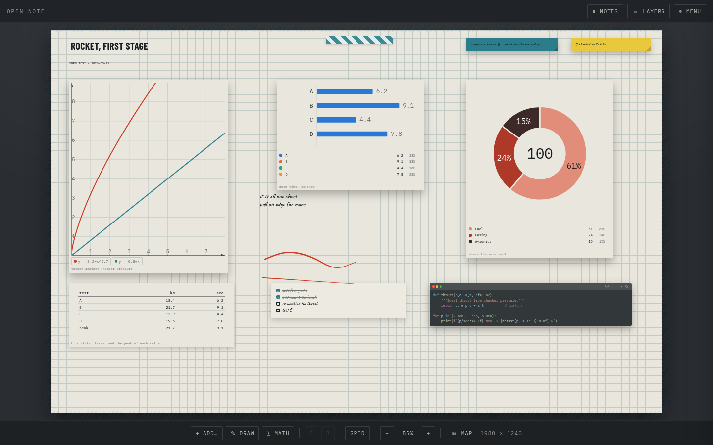
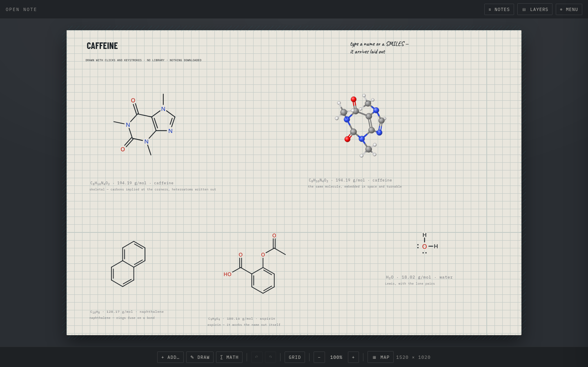
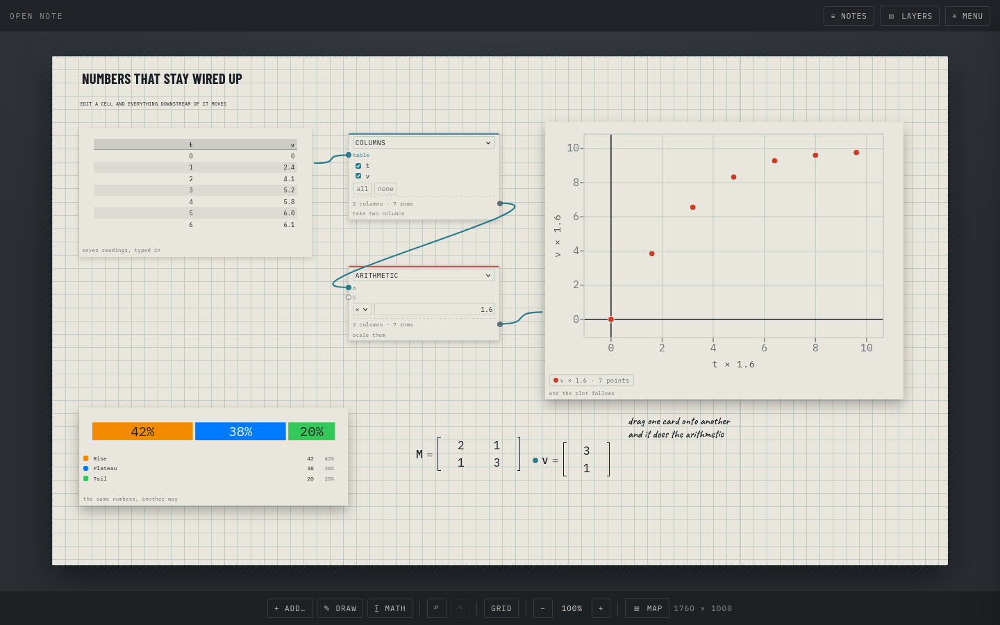
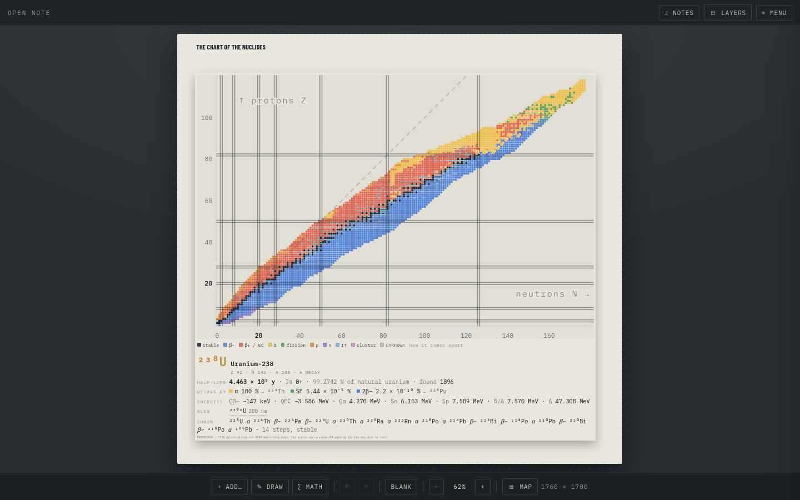
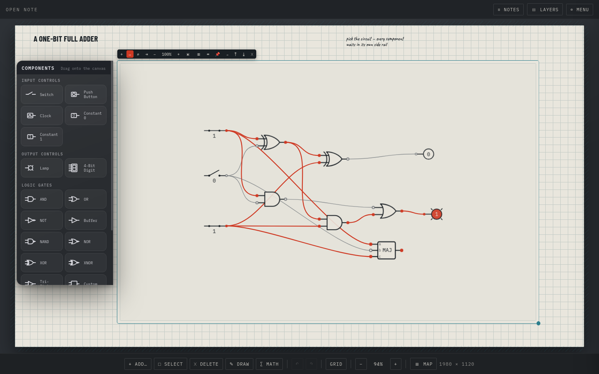

# Open Note

An endless canvas for notes, sketches, data and maths. No servers, no accounts, no telemetry — it runs entirely on your machine, and everything it needs to draw itself ships with it.

A note is one sheet of paper that never runs out: pull an edge and there is more of it. Put text, tables, plots, charts, code, molecules, logic circuits, 3D models, slide decks and hand-drawn ink anywhere on it, tie them together with string, and draw over the lot with a stylus.



Every picture on this page was taken by the app itself — `tools/shots/run.sh` builds each arrangement out of real items and photographs it in headless Firefox, so none of it is a mock-up and none of it can quietly go stale.

## What it can do

### Chemistry that knows what you drew

Draw a molecule the way a chemist does — skeletal, carbons implied at the corners — or type a name or a SMILES string and watch it arrive laid out. Underneath it, the **formula, the molar mass and the name** it worked out for itself. Then turn it into three dimensions and spin it.



There is no runtime dependency behind any of this and nothing is downloaded: `js/lib/chem.js` is the molecular graph, implicit hydrogens and lone pairs, rings and aromaticity, SMILES in and out, the 2D layout, the 3D embedding and VSEPR — about a thousand lines, and it touches no DOM at all. A generated, offline PubChem catalog adds 10,000 unique structures and more than 17,000 searchable canonical and systematic names; exact lookups use a map, prefix suggestions use a sorted index, and precomputed graph hashes recognise a drawing without parsing the catalog. Bond lengths in the 3D view land within 12 % of the real ones, which the test harness checks on every run.

### Numbers that stay wired up

A table, a couple of little dataflow cards, and a coordinate system. Change a cell and everything downstream of it moves — the columns picked out of the table, the arithmetic done to them, the points on the plot, and the axis names, which are worked out from the chain rather than typed.



Spreadsheet formulas (`=MAX(B2:B5)`), real `.xlsx`, `.ods` and `.csv` files read straight off the disk with no library — a workbook is a zip of XML, and the browser already has an unzipper. Charts with six palettes — four fixed sets validated for colour-blind separation against all four papers, and two stepped live from the note's own colours. Matrices and vectors you drag onto one another to multiply.

### A whole wall chart of the nuclides

Every nuclide that has ever been made or found: 3558 ground states and 2088 metastable ones from NUBASE2020, on the plane physicists actually use — neutrons across, protons up. Four colourings, pan and zoom, and click any square to get its half-life, its decay branches, its Q values and its chain all the way down.



The Q values, separation energies and binding energy per nucleon are not stored — they are arithmetic done on the mass excesses as you press. The harness checks the binding-energy curve peaks on ⁶²Ni and that the four natural series walk to lead, lead, lead and thallium.

### FITS files, read without a Python prompt

Drop an astronomy `.fits` on the sheet and click it. The reader opens on the same table `hdu.info()` prints — number, name, version, type, cards, dimensions, format — and picking a row brings its header up underneath: keyword, value and comment in three columns that line up down the page, with a search box that looks in all three. Runs of `COMMENT` and `HISTORY` fold themselves away, which is most of what makes a real header unreadable.

**None of the data is ever read.** A data unit is shown as a shape, a type and a size — `(2048, 2048) uint16`, `4,204,881 rows × 5 columns · 192 MB` — and a binary table's columns are listed with what one cell of each holds. `js/lib/fits.js` walks the file header by header and steps over every data unit without touching it, so a four-gigabyte cube opens as fast as a small one, and nothing tries to put a million numbers on a page.

Then **pick columns of a binary table and drag them off the window**. The reader steps out of the way while you aim, and what lands on the sheet is an ordinary table — so it sorts, exports, feeds a node graph and drops onto a coordinate system to be plotted. How much of a four-million-row column comes over is decided before a byte is read and said out loud in the table's foot: whole if it fits, otherwise spread across the whole of it every nth row so the shape of a light curve survives, and only failing that its first rows.

No library, nothing downloaded: a FITS file is 80-column ASCII cards in 2880-byte blocks, and the arithmetic that finds the next header is a handful of lines. `CONTINUE`d strings are joined back up, `HIERARCH` keywords keep their real names, and BZERO 32768 on BITPIX 16 is reported as the unsigned integer it means.

### Logic gates you can flick

Conventional ANSI gate symbols live together in a contained circuit workspace, wired port to port. Flick a switch, hold a push button or start a clock and the ones run down the wires immediately — there is no global run button or simulation step, and operating a control does not pop open an options toolbar.



The **Science** shelf also has **Feynman diagrams**. Time runs upward on a plotted `t`/`x` axis, drawing from the middle of a propagator creates a true shared interaction vertex, and a searchable library supplies connected, validated diagrams for beta decay, QED, QCD, muon and Higgs processes. Its particle chip opens the Standard Model, its ghost previews the exact propagator before a stroke lands, and its validator refuses particle combinations or charge-flow arrows that do not belong to a Standard Model interaction. The loop tool lays down circulating propagators in one gesture; the molecule-style lasso turns, moves, copies or removes part of a diagram. Finished diagrams export as transparent SVG or PNG, while the LaTeX action copies an editable, explicitly positioned TikZ-Feynman block—including the axes—straight to the clipboard, with no `.tex` file in between.

Select a **Logic circuit** and a larger, wheel-scrollable side rail opens into **Input controls, Output controls, Logic gates and Flip-flops**, with every component shown by icon and name. Drag one to the exact spot you want, or click it for quick placement. The canvas itself stays clean: **Move**, **Inspector**, **Tidy**, local zoom, canvas visibility and the searchable circuit library live in the ordinary contextual toolbar that appears only while the canvas is selected. Wheel over the canvas to zoom its contents around the pointer, drag empty canvas to pan, or pull the corner handle to resize the canvas itself. Local zoom never resizes the frame, and making the frame wider reveals workspace without automatically enlarging components. Alongside the eight standard gates are a tri-state buffer, a push button, a variable-speed clock, constants, a lamp, a four-bit hexadecimal display, SR/D/JK/T flip-flops and a **custom gate whose truth table you fill in yourself**.

Nothing is a picture of a gate: a component is stored as `{gate:"nand"}` and drawn from shared SVG primitives, so NAND really is AND plus the one inversion bubble every inverting gate wears. Components sit above their leads; their paper fill is slightly translucent, so a wire passing underneath remains faintly traceable without obscuring the symbol. Each symbol's own port stubs stop exactly at its outline, keeping the interior clean. Wire a combinational loop and it says so instead of hanging. **Tidy** lays the contained circuit out by signal flow with clean orthogonal leads.

### And the rest

**Library** — an Obsidian-style file explorer with nested folders, contextual right-click actions, canvas notes, editable Markdown files, search, drag-in/out organisation and imports for PDFs, spreadsheets, FITS and ordinary files. Markdown keeps its plain source while gaining a formatting bar, nested smart lists and tasks, keyboard shortcuts, a document that recompiles as you type, live equation help and the canvas's syntax-coloured code cells. **Dashboard** — one screen for the library: a month you can walk back through, the files you were last in, a year of your working days as a GitHub-style heat map drawn from a record the app keeps itself, and a force-directed graph of every `[[link]]` between your files that you can drag, zoom and click through. **Linked notes** — `[[double brackets]]` join Markdown files and canvases to each other, with a completion list as you type, a link to a note you have not written yet that offers to start it, and a rename that carries every mention of it along. **Write** — text in five styles, sticky notes, checklists, a terminal-style code cell syntax-coloured for twelve languages, flip cards in eight looks that take any widget off the palette with a right-click, keep a record of every run, and go to the desk as a window of their own that outlives the app. **Media** — pictures, video, `.obj` models in their own little window, `.pptx` decks that draw themselves as SVG, file attachments and the folders they file into. **Shapes** — five wireframe solids to draw over. **Over the top of all of it** — a stylus, layers, string tied between anything and anything, and a toolbar selection mode that drags a rectangle around several things so they move or delete as one on a mouse or touchscreen.

Then take it out again: one self-contained `.html` anyone can open, a PDF, or a `.json` backup that restores anywhere.

## Run it

**As a desktop app.** Grab the build for your system from [Releases](../../releases) and open it — nothing to install alongside it, and no browser involved.

| | File | First run |
| --- | --- | --- |
| Linux | `.AppImage` | `chmod +x` it, then open it. Nothing is installed. |
| Windows | `-setup.exe` to install, or `-portable.exe` to just run it | SmartScreen will warn. **More info → Run anyway.** |
| macOS | `.dmg` | Right-click the app → **Open**, once. Double-clicking shows a "damaged" error. |

The alpha builds are **unsigned**, which is what those two warnings are about — a certificate costs money per year and buys nothing until the app is worth trusting. If that bothers you, build it yourself from source; it is the same code.

**From source**, if you would rather:

```
npm install
npm start
```

**In a browser.** Double-click `index.html`, or serve the folder:

```
python3 -m http.server 8000     # then open http://localhost:8000
```

Everything is saved automatically, on your machine, using IndexedDB. The desktop app and the browser keep **separate** libraries — they are different origins, so a note made in one does not appear in the other. Move one across with **Back up** on one side and **Restore** on the other, and back up regularly either way if the note matters to you.

## Documentation

| Guide | What's in it |
| --- | --- |
| [Manual](docs/manual.md) | Everything you can put on the sheet — tables, nodes, logic gates, equations, maths, charts, the stylus, shapes, `.obj` models, `.pptx` decks, attachments, folders, flip cards, layers. |
| [How it's built](docs/architecture.md) | The shape of it, the five rules, the platform seam, the module map, the registry, and how to add a feature without touching anything else. |
| [The pictures](tools/shots/README.md) | How the screenshots on this page are rebuilt from the app, and the traps in adding a scene. |
| [Verification](tools/verify/README.md) | Two harnesses: `run.sh` drives the app in headless Firefox, `desktop.sh` drives the Electron shell. Both print a pass/fail report; CI gates release builds on the second. |

## Layout

```
index.html        the app shell — markup, base stylesheet and the script list
js/platform/      the seam between the app and its host — browser, Electron, later a phone
js/core/          the engine — the note, the sheet, items, state, store, history, drag, zoom, save
js/paper/         drawn on the sheet, belonging to no one item — ink, strings, layers
js/chrome/        the tools around the sheet — palette, toolbars, shelf, map, export
js/items/<shelf>/ one file per item type, foldered by its palette shelf
                  write/ math/ logic/ science/ media/ shapes/ decor/
js/lib/           algorithms that owe nothing to this app — latex, pptx, workbook, fits, chem, spring
js/data/          tables the lib files read — the nuclides, the elements. Data, never code
fonts/            the four families, carried locally so nothing needs the network
desktop/          the Electron shell — main process and icon; wraps the app, never part of it
tools/verify/     headless-Firefox verification harness — 2355 assertions
tools/shots/      rebuilds the pictures above from the real app
docs/             manual, architecture, and those pictures
```

**No build step, and none coming.** No bundler, no transpiler, no runtime dependencies — nothing in `js/` is generated, and double-clicking `index.html` opens a working app. `package.json` belongs to the Electron shell in `desktop/`, which wraps the app and is never imported by it.

Only `index.html`, `js/`, `fonts/` and `desktop/` are packaged into a build — `package.json`'s `build.files` is a whitelist, so docs and tooling stay in the repo and out of the app.

## Checking it still works

There is no test runner — the app *is* the test.

```
tools/verify/run.sh        # 2355 assertions, in headless Firefox
tools/verify/desktop.sh    # 47 more, driving the real Electron shell
tools/shots/run.sh         # rebuild the pictures in this README
```

## Cutting a release

```
npm version 0.1.0-alpha.4 --no-git-tag-version   # edit the version
git commit -am "Release 0.1.0-alpha.4"
git tag v0.1.0-alpha.4
git push origin main --tags
```

**Check `git diff package.json` before committing.** `npm version` rewrites the whole file with its own formatting, which turns a one-line version bump into thirty lines of churn through the `build` block. Either put the version back by hand afterwards, or just edit the one line and skip npm.

`.github/workflows/release.yml` builds all three platforms on their own runners and collects them into one GitHub Release. A tag carrying `-alpha` or `-beta` is published as a pre-release. Nothing is signed and nothing auto-updates yet.

## The marketing website

It lives in its own repository, `open-note-site`, and ships no app code.
